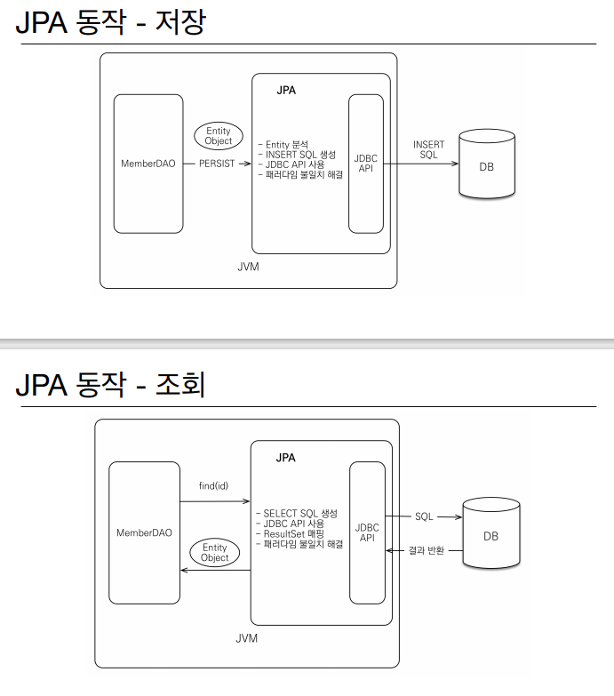

# SQL중심적인 개발의 문제점

* 개발자는 SQL 매퍼를 짜주는 일만 하게 된다
* 객체를 테이블에 맞추어 모델링을 하면 객체지향프로그래밍같지 않다
* 객체답게 모델링 할수록 매핑 작업만 늘어난다
* 처음 실행하는 SQL에 따라 탐색 범위 결정된다
* 엔티티 신뢰문제, 어디까지 실행되었는지 알수 없으니 객체가 어떤 데이터를 참조하고 있는지 알 수 없다
* 그렇다고 모든 객체를 미리 로딩할 수 는 없다.

 ### 객체를 자바 컬렉션에 저장하듯이 DB에 저장하는 기술 -> JPA 

*  Java Persistence API

* 자바진영의 ORM 기술 표준

  

# ORM

* 객체는 객체대로 설계, 관계형 DB는 관계형 DB형태로 설계
* 객체와 DB 사이를 매핑해주는 ORM 프레임워크

#  JPA 는 표준 명세

* JPA는 인터페이스의 모음
* JPA2.1 표준 명세를 구현한 3가지 구현체
* 하이버네이트, EclipseLink, DataNucleus

# JPA를 왜 사용해야 하는가?

* 생산성
  * 저장 : jpa.persist(member)
  * 조회 : Member member = jpa.find(memberId)
  * 수정 : member.setName("변경할이름") 
  * 삭제: jpa.remove(member)
* 유지보수
  * 기존 : 필드 변경시 모든 SQL 수정
  * JPA : 필드만 추가하면됨, SQL은 JPA가 처리
* JPA와 패러다임의 불일치 해결
  * JPA와 상속
  * JPA와 연관관계
    * 자유로운 객체 그래프 탐색 - 지연 로딩 기능
* JPA와 비교하기
  * 동일 트랜잭션에서 조회한 엔티티는 같음을 보장

# JPA 의 성능 최적화 기능

1. 1차 캐시와 동일성(identity) 보장
   * 같은 트랜잭션 안에서는 같은 엔티티를 반환 - 약간의 조회 성능 향상
   * DB Isolation Level 이 Read Commit 이어도 애플리케이션에서 Repeatable Read 보장
2. 트랜잭션을 지원하는 쓰기 지연(transaction write-behind)
   * 버퍼링 기능
   * 트랜잭션을 커밋할 떄까지 insert sql을 모음
   * jdbc batch sql 기능을 사용해서 한번에 SQL 전송
   * transaction.commit() // 옵션하나를 켜주면 알아서 sql 모아서 보냄(최적화)
3. 지연 로딩(lazy loading)
   * 지연 로딩 : 객체가 실제 사용될 때 로딩
   * 즉시 로딩: join sql 로 한번에 연관된 객체까지 미리 조회